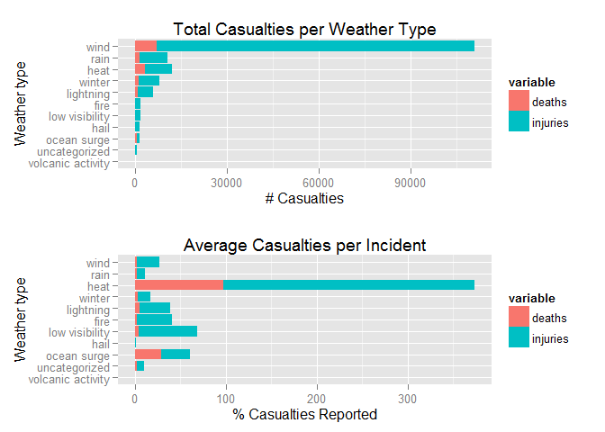

# Assessing Health and Economic Impact of Weather Events
## Executive Summary

This study U.S. National Oceanic and Atmospheric Administration's
(NOAA) storm database. This database tracks characteristics of major
storms and weather events in the United States, including when and
where they occur, as well as estimates of any fatalities, injuries,
and property damage.

## Questions this study considers

  1. Across the United States, which types of events (as indicated in the EVTYPE variable) are most harmful with respect to population health?
  1. Across the United States, which types of events have the greatest economic consequences?

## Notes about the environment used
This study was done using the following tools, including OS and Programming language versions

The study was conducted on a 64-bit Windows 7 machine with 4 cores.

R language was R version 3.1.1 (2014-07-10)

For publishing to `rbups.com`, I used RStudio version 0.98.1103

The full project may be found on Github at `https://github.com/gregoryg/05-reproducible-research-assignment-2`

## Processing the data set
### Set libraries used in this analysis

```r
library(stringr)
library(lubridate)
library(sqldf)
library(ggplot2)
library(reshape2)
library(gridExtra)
## multiplot(), for creating very flexible panel plots using ggplot2
## it is taken from Cookbook for R http://www.cookbook-r.com/Graphs/Multiple_graphs_on_one_page_(ggplot2)/
# Multiple plot function
#
# ggplot objects can be passed in ..., or to plotlist (as a list of ggplot objects)
# - cols:   Number of columns in layout
# - layout: A matrix specifying the layout. If present, 'cols' is ignored.
#
# If the layout is something like matrix(c(1,2,3,3), nrow=2, byrow=TRUE),
# then plot 1 will go in the upper left, 2 will go in the upper right, and
# 3 will go all the way across the bottom.
#
multiplot <- function(..., plotlist=NULL, file, cols=1, layout=NULL) {
  library(grid)

  # Make a list from the ... arguments and plotlist
  plots <- c(list(...), plotlist)

  numPlots = length(plots)

  # If layout is NULL, then use 'cols' to determine layout
  if (is.null(layout)) {
    # Make the panel
    # ncol: Number of columns of plots
    # nrow: Number of rows needed, calculated from # of cols
    layout <- matrix(seq(1, cols * ceiling(numPlots/cols)),
                    ncol = cols, nrow = ceiling(numPlots/cols))
  }

 if (numPlots==1) {
    print(plots[[1]])

  } else {
    # Set up the page
    grid.newpage()
    pushViewport(viewport(layout = grid.layout(nrow(layout), ncol(layout), widths=unit(800, "points"), heights=unit(800, "points"))))

    # Make each plot, in the correct location
    for (i in 1:numPlots) {
      # Get the i,j matrix positions of the regions that contain this subplot
      matchidx <- as.data.frame(which(layout == i, arr.ind = TRUE))

      print(plots[[i]], vp = viewport(layout.pos.row = matchidx$row,
                                      layout.pos.col = matchidx$col))
    }
  }
}
```
### Loading the data

```r
dseturl <- "https://d396qusza40orc.cloudfront.net/repdata%2Fdata%2FStormData.csv.bz2"
dsetzip <- "data/StormData.csv.bz2"
dsetrds <- "data/StormData.RDS"

if (!file.exists(dsetzip)) {
    download.file(url = dseturl,
                  destfile = dsetzip,
                  method = "curl")
}

## For faster processing, check for R Data Set save file
## To force data cleaning, delete .RDS file before running/knitting/weaving
RDSloaded <- FALSE
if (!file.exists(dsetrds)) {
    d <- read.csv(file = bzfile(dsetzip), strip.white = TRUE)
} else {
    d <- readRDS(dsetrds)
    RDSloaded <- TRUE
}
```

## Cleaning the data

Because we want to determine the most costly disasters, we have to
examine the the property damage (`PROPDMG`) and crop damage
(`CROPDMG`) values.  These are simple integers which must be
multiplied by an exponent given in another field (`PROPDMGEXP` and
`CROPDMGEXP` respectively.  Unfortunately, not all of the exponent
values are valid; many appear to be rounding or entry errors from
older entry systems.

For the purposes of this study, we accept only the following values
for exponent:
  * H hundred (x100)
  * K thousand (x1,000)
  * M million (x1,000,000)
  * B billion (x1,000,000,000)


```r
if(!RDSloaded) {
    calcUSD <- function(dmg, dmgexp) dmg * switch(toupper(dmgexp), H=100, K=1000, M=1000000, B=1000000000, 1)

    d$pdmgUSD <- mapply(calcUSD, d$PROPDMG, d$PROPDMGEXP)
    d$cdmgUSD <- mapply(calcUSD, d$CROPDMG, d$CROPDMGEXP)
}
```

To assist in date analysis, we will convert dates to POSIXct format


```r
if(!RDSloaded)
    d$BEGIN_UTC <- mdy(str_extract(d$BGN_DATE, "[^ ]+"))
```

The manual entry nature of the data causes huge difficulties in
categorizing the weather events.  For example, you will find high wind
events entered in completely arbitrary ways, mixing terminology,
abbreviations, upper and lower case etc. (`thunderstorm`, `gusty
thundertorm wind`, `gusty wind/rain`, `marine tstm wind`).  We are
going to attempt to categorize the most impactful events by looking
for common words and abbreviations in a relative handful of weather
categories.


```r
if (!RDSloaded) {
    generateEvent <- function(evt) {
        evt <- tolower(evt)
        ifelse(grepl("lightning", evt), "lightning",
               ifelse(grepl("hail", evt), "hail",
                      ifelse(grepl("rain|flood|wet|fld", evt), "rain",
                             ifelse(grepl("snow|winter|wintry|blizzard|sleet|cold|ice|freeze|avalanche|icy", evt), "winter",
                                    ifelse(grepl("thunder|tstm|tornado|wind|hurricane|funnel|tropical +storm", evt), "wind",
                                           ifelse(grepl("fire", evt), "fire",
                                                  ifelse(grepl("fog|visibility|dark|dust", evt), "low visibility",
                                                         ifelse(grepl("surf|surge|tide|tsunami|current", evt), "ocean surge",
                                                                ifelse(grepl("heat|high +temp|record +temp|warm|dry", evt), "heat",
                                                                       ifelse(grepl("volcan", evt), "volcanic activity",
                                                                              "uncategorized"
                                                                              ))))))))))
    }
    d$weatherCategory <- mapply(generateEvent, d$EVTYPE)
}
```


For purporses of this study, USA is defined as the 50 states in the
continental US, plus District of Columbia, Hawaii and
Alaska. territories, protectorates, and military regions are excluded


```r
if (!RDSloaded)
    d$isUSA <- mapply( function(st) st %in% state.abb, d$STATE )
```

In the interest of performance, we will save the data frame as an R
data set (`.RDS` file).  After reading, immediately subset the data to
only those records originating in the US.


```r
if (!RDSloaded) {
    saveRDS(d, file=dsetrds)
    d <- readRDS(dsetrds)
    RDSloaded <- TRUE
}
## subset to only USA data
d <- d[d$isUSA == TRUE,]
```

## Results
  1. Across the United States, which types of events (as indicated in the EVTYPE variable) are most harmful with respect to population health?

Refer to the result of the query below, which groups US mortalities and injuries by weather category.


```r
harm <- sqldf("select sum(FATALITIES) as deaths, sum(INJURIES) as injuries, weatherCategory,count(*) as sumrecs from d group by weatherCategory ")

harm$weatherCategory <- factor(harm$weatherCategory, levels=harm[order(harm$injuries), "weatherCategory"])
harm <- sqldf("select *,(injuries/sumrecs)*100 as pctInjuriesPerEvent from harm")

## ggplot loves long form, which means a type of normalization using melt()
hdat <- melt(harm, id.vars=c("weatherCategory", "sumrecs"), measure.vars=c("deaths", "injuries"))
hdat <- sqldf("select *,(value/sumrecs)*100 as pctPerEvent from hdat")
plot1 <- ggplot(hdat, aes(x=weatherCategory, y=value, fill=variable)) + geom_bar(stat="identity") + coord_flip() + ggtitle("Total Casualties per Weather Type") + xlab("Weather type") + ylab("# Casualties")
plot2 <- ggplot(hdat, aes(x=weatherCategory, y=pctPerEvent, fill=variable)) + geom_bar(stat="identity") + coord_flip() + ggtitle("Average Casualties per Incident") + xlab("Weather type") + ylab("% Casualties Reported")
grid.arrange(plot1, plot2, ncol=1)
```

 

## Appendix
### Utility functions
Some functions not used in the published analysis that may be useful


```r
## timeconv() is used to take inconsistent times and convert them to a standard format
## times will either be 24-hour HHMM ("1330") or 12-hour strings with AM/PM ("01:30:00 PM")
## functions returns format of 24-hour HH:MM:SS ("13:30:00")
timeconv <- function(x) {
    if (nchar(x) == 4) {
        paste(substr(x,1,2), substr(x,3,4), "00", sep=":")
    } else {
        timeadd <- 1
        if (substr(x,nchar(x)-1,nchar(x)) == "PM") timeadd <- 12
        paste0(
            formatC(as.integer(substr(x,1,2)) + timeadd, width=2, format="d", flag="0"),
            substr(x,3,nchar(x)-3))
    }
}
```

